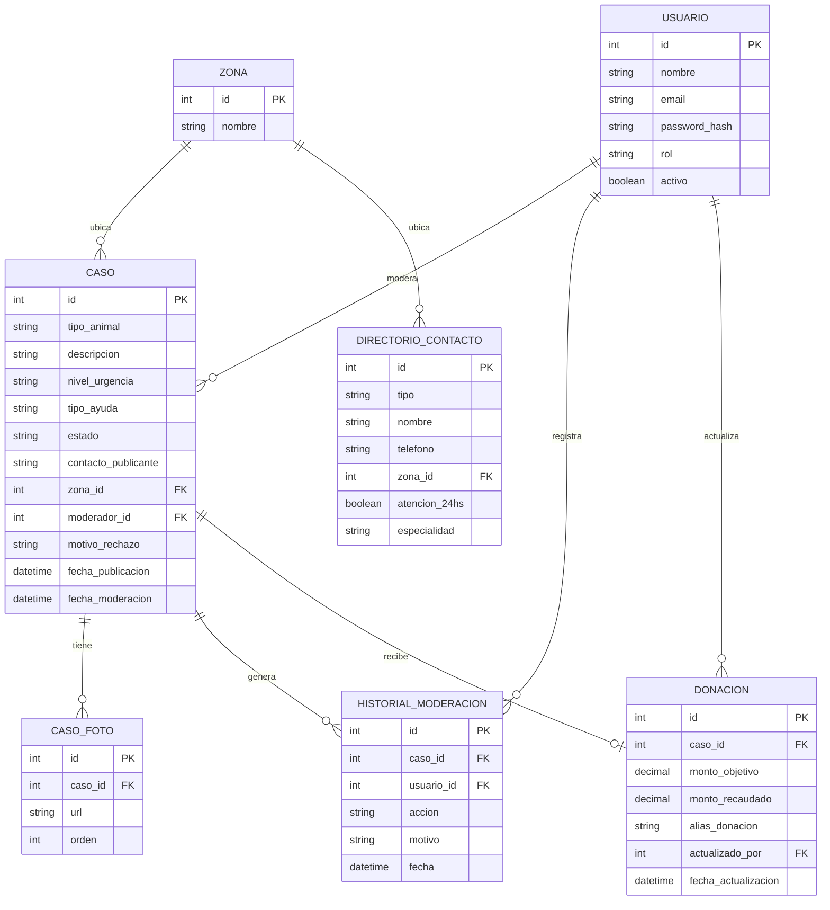
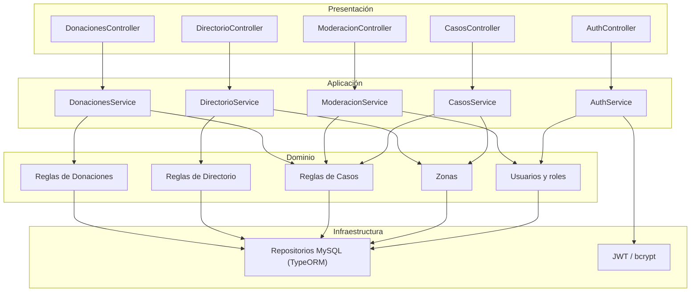

# Segunda Entrega — Diseño de Base de Datos y Listado de Módulos

**Proyecto:** SOS Patitas · **Grupo:** 159 — Guardia / Ortellado
**Parte de:** RF01–RF09 y RNF01–RNF05 aprobados en la primera entrega.

Este documento es el detalle completo del diseño de base de datos y la modularización del sistema, correspondiente a la Segunda Entrega. El README tiene un resumen breve de este contenido y enlaza acá para el detalle completo, siguiendo la consigna de la segunda entrega (esquema de base de datos, listado de módulos y arquitectura documentados en /docs).

---

## 1. Diagrama entidad-relación (DER)

**Notas de cardinalidad:** `moderador_id` en `CASO` es nulo hasta que un
moderador toma el caso (por eso se simplifica como relación uno-a-muchos,
aunque el caso pueda no tener moderador asignado todavía). `DONACION` es
opcional por caso — solo existe si el caso requiere ayuda económica
registrada, de ahí la cardinalidad cero-o-uno del lado de `DONACION`.

## 2. Esquema relacional (MySQL)

El DDL completo y ejecutable está en [`/database/schema.sql`](/database/schema.sql).

| Tabla | Columna | Tipo | Restricción |
|---|---|---|---|
| **zona** | id | INT | PK, AUTO_INCREMENT |
| | nombre | VARCHAR(80) | NOT NULL, UNIQUE |
| **usuario** | id | INT | PK, AUTO_INCREMENT |
| | nombre | VARCHAR(120) | NOT NULL |
| | email | VARCHAR(160) | NOT NULL, UNIQUE |
| | password_hash | VARCHAR(255) | NOT NULL |
| | rol | ENUM('moderador','administrador') | NOT NULL |
| | activo | BOOLEAN | NOT NULL, DEFAULT true |
| **caso** | id | INT | PK, AUTO_INCREMENT |
| | tipo_animal | VARCHAR(60) | NOT NULL |
| | descripcion | TEXT | NOT NULL |
| | nivel_urgencia | ENUM('critica','media','baja') | NOT NULL |
| | tipo_ayuda | ENUM('veterinaria','traslado','alimento','otro') | NOT NULL |
| | estado | ENUM('pendiente','en_revision','aprobado','rechazado','resuelto') | NOT NULL, DEFAULT 'pendiente' |
| | contacto_publicante | VARCHAR(160) | NOT NULL |
| | zona_id | INT | FK → zona.id, NOT NULL |
| | moderador_id | INT | FK → usuario.id, NULL |
| | motivo_rechazo | VARCHAR(255) | NULL |
| | fecha_publicacion | DATETIME | NOT NULL, DEFAULT NOW() |
| | fecha_moderacion | DATETIME | NULL |
| **caso_foto** | id | INT | PK, AUTO_INCREMENT |
| | caso_id | INT | FK → caso.id, NOT NULL |
| | url | VARCHAR(500) | NOT NULL |
| | orden | INT | NOT NULL, DEFAULT 1 |
| **historial_moderacion** | id | INT | PK, AUTO_INCREMENT |
| | caso_id | INT | FK → caso.id, NOT NULL |
| | usuario_id | INT | FK → usuario.id, NOT NULL |
| | accion | ENUM('aprobado','rechazado','en_revision') | NOT NULL |
| | motivo | VARCHAR(255) | NULL |
| | fecha | DATETIME | NOT NULL, DEFAULT NOW() |
| **directorio_contacto** | id | INT | PK, AUTO_INCREMENT |
| | tipo | ENUM('veterinaria','rescatista') | NOT NULL |
| | nombre | VARCHAR(160) | NOT NULL |
| | telefono | VARCHAR(40) | NOT NULL |
| | zona_id | INT | FK → zona.id, NOT NULL |
| | atencion_24hs | BOOLEAN | NOT NULL, DEFAULT false |
| | especialidad | VARCHAR(120) | NULL |
| **donacion** | id | INT | PK, AUTO_INCREMENT |
| | caso_id | INT | FK → caso.id, NOT NULL, UNIQUE |
| | monto_objetivo | DECIMAL(10,2) | NULL |
| | monto_recaudado | DECIMAL(10,2) | NOT NULL, DEFAULT 0 |
| | alias_donacion | VARCHAR(80) | NOT NULL |
| | actualizado_por | INT | FK → usuario.id, NOT NULL |
| | fecha_actualizacion | DATETIME | NOT NULL, DEFAULT NOW() |

### Índices principales

- `idx_caso_zona`, `idx_caso_estado`, `idx_caso_urgencia` sobre `caso`: soportan el listado público filtrable por zona/urgencia/tipo de ayuda (RF05).
- `idx_directorio_zona` sobre `directorio_contacto`: soporta el filtro del directorio por zona (RF06).
- `uq_usuario_email` (único) sobre `usuario`: soporta el login (RNF02) y evita duplicados.
- `uq_donacion_caso` (único) sobre `donacion`: refleja que se asume un único registro de donación por caso (RF07).
- Los FK (`caso_id`, `usuario_id`, `zona_id`, `moderador_id`, `actualizado_por`) quedan indexados para no degradar los JOIN de las consultas de listado y moderación.

### Normalización aplicada

El esquema está normalizado (3FN): no hay grupos repetitivos (las fotos de
un caso no se guardan como una lista dentro de una columna, sino en
`caso_foto`), no hay datos derivables o redundantes entre tablas, y cada
atributo no clave depende únicamente de la clave primaria de su tabla.
`zona` existe como catálogo propio en lugar de texto libre repetido en
`caso` y `directorio_contacto`, lo que evita inconsistencias y sostiene
RNF04 (poder sumar zonas o ciudades sin rediseñar el modelo).

---

## 3. Listado de módulos

| Módulo (NestJS) | Capa principal | Responsabilidad (alta cohesión) | RF/RNF que cubre | Dependencias (bajo acoplamiento) | Prioridad |
|---|---|---|---|---|---|
| `ZonasModule` | Dominio | Catálogo de zonas/barrios de CABA, extensible a otras ciudades | RNF04 | Ninguna (módulo base) | **Alta** — lo consumen Casos y Directorio |
| `UsuariosModule` | Dominio | Alta de usuarios, gestión de roles (moderador/administrador) | RF09 | Ninguna (módulo base) | **Alta** — lo consumen Auth y Moderación |
| `AuthModule` | Presentación / Infraestructura | Login de moderador/administrador, emisión y validación de JWT, guards por rol | RNF02 | `UsuariosModule` (vía servicio) | **Alta** |
| `CasosModule` | Dominio / Aplicación | Publicación de casos sin registro, consulta pública filtrable, carga de fotos, generación de enlace compartible | RF01, RF05, RF08 | `ZonasModule` | **Alta** |
| `ModeracionModule` | Aplicación | Cola de revisión, aprobar/rechazar/marcar en revisión, registro de historial | RF02, RF03, RF04 | `CasosModule`, `UsuariosModule` (vía servicio) | **Alta** |
| `DirectorioModule` | Dominio | Alta, edición y consulta de veterinarias/rescatistas por zona | RF06 | `ZonasModule` | Media |
| `DonacionesModule` | Dominio | Registro y actualización manual de monto objetivo/recaudado por caso | RF07 | `CasosModule`, `UsuariosModule` (vía servicio) | Media — etapa 5 del cronograma |

> Prioridad asignada en base al cronograma por etapas ya definido en el
> README (Entregables por etapa, Actividad 3). RNF01, RNF03 y RNF05 son
> transversales (usabilidad, disponibilidad, mantenibilidad) y no se
> asignan a un único módulo.

## 4. Arquitectura del proyecto

### Arquitectura en capas

Se aplican los cuatro principios trabajados en la cátedra: **bajo
acoplamiento y alta cohesión**, **separación de responsabilidades (SoC)** y
**principio de única responsabilidad (SRP)**, organizados en la arquitectura
en capas estándar de NestJS:

1. **Presentación:** controllers — reciben la request HTTP y devuelven la respuesta, sin lógica de negocio.
2. **Aplicación:** services de orquestación — coordinan qué módulo hace qué y en qué orden, sin contener las reglas de negocio en sí.
3. **Dominio:** reglas de negocio — qué estados puede tener un caso, quién puede aprobar, cómo se calcula el monto recaudado.
4. **Infraestructura:** acceso a MySQL, JWT/bcrypt para autenticación, configuración de Railway.

### Diagrama de dependencias entre módulos

El diagrama muestra que las dependencias siguen siempre el mismo sentido
(Presentación → Aplicación → Dominio → Infraestructura) y que ningún módulo
de Dominio depende de otro módulo de Dominio directamente: cuando hace
falta cruzar información entre dominios (por ejemplo, Moderación
necesitando saber si un usuario es moderador), la comunicación pasa por la
capa de Aplicación, nunca por acceso directo a los datos de otro módulo.

Ejemplo concreto de bajo acoplamiento aplicado al proyecto: cuando
`ModeracionModule` necesita saber si un usuario tiene rol de moderador, **no
accede directamente a la tabla `usuario`** — le pregunta a `UsuariosModule` a
través de su servicio, y recibe sólo verdadero/falso. Así, si mañana cambia
cómo se gestionan los roles, `ModeracionModule` no se ve afectado.

### Tecnologías definitivas

| Capa | Tecnología |
|---|---|
| Frontend | HTML/CSS/JavaScript (vanilla) |
| Backend | NestJS (Node.js/TypeScript) |
| ORM | TypeORM |
| Base de datos | MySQL |
| Autenticación | JWT + bcrypt |
| Despliegue | Railway |

## 5. Actividad 3 — Refinamiento con IA

Para esta actividad se utilizó **Claude**, tanto para interpretar la consigna de la unidad como para generar una primera propuesta del diagrama entidad-relación y del listado de módulos, a partir de los requerimientos definidos en la primera entrega.

Esa primera propuesta no se tomó como definitiva: se revisó críticamente contra las reglas de negocio del proyecto, ajustando puntos como la necesidad de un registro de auditoría de las acciones de moderación (`historial_moderacion`), el carácter opcional de la donación por caso (no todo caso publicado requiere ayuda económica) y el uso de `zona` como catálogo propio en lugar de texto libre, para sostener el crecimiento a otras zonas sin rediseñar el modelo (RNF04).

Adicionalmente, con el documento de entrega ya armado, se realizó una segunda consulta a Claude para revisar que la entrega cubriera todo lo solicitado por la cátedra en esta unidad. Esa revisión permitió detectar que el uso de IA no estaba documentado en la primera versión del archivo, lo que llevó a incorporar esta misma sección.